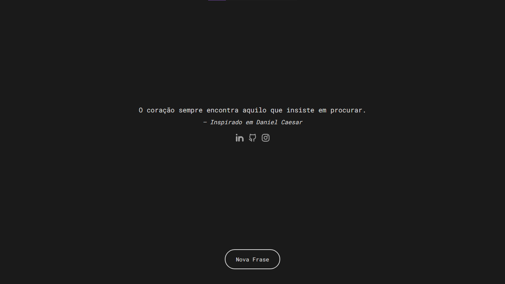

# ✺ Frases Minimalistas ✺

Um gerador de frases inspiracionais com design minimalista, tema claro/escuro automático e ícones de redes sociais animados. Feito com HTML, CSS e JavaScript puro — sem frameworks, sem dependências.

## ✹ Objetivo

Criar uma ferramenta simples e direta para gerar frases motivacionais com um clique, unindo um design limpo a interações sutis (animações, tema adaptável) que tornam a experiência mais agradável sem tirar o foco do conteúdo.

## ✹ Design

O projeto segue uma linha minimalista: tipografia monoespaçada, paleta reduzida (preto/branco), bastante espaço em branco e nenhum elemento visual desnecessário. O tema (claro ou escuro) se adapta automaticamente à preferência do sistema operacional do usuário, sem precisar de botão de alternância.

## ✹ Funcionalidades

- **Frases aleatórias:** um array de frases e autores é sorteado a cada clique no botão.
- **Exibição imediata:** uma frase já aparece assim que a página carrega, antes de qualquer interação.
- **Tema claro/escuro automático:** dois arquivos CSS aplicados via `prefers-color-scheme`, sem JavaScript envolvido.
- **Ícones de redes sociais animados:** SVGs inline que desenham a si mesmos ao passar o mouse (hover), usando animação nativa SVG (SMIL) — sem bibliotecas externas.
- **Layout responsivo:** centralizado com Flexbox, se adapta a qualquer tamanho de tela.

## ✹ O que aprendi

- Manipulação de arrays de objetos em JavaScript (`{ frase, autor }`) e como separar lógica em funções com responsabilidade única (sortear vs. exibir).
- Manipulação do DOM com `getElementById` e `textContent` para atualizar conteúdo dinamicamente.
- CSS condicional por preferência do sistema (`prefers-color-scheme`) para temas claro/escuro sem JavaScript.
- Animações SVG nativas (SMIL) disparadas por eventos (`begin="mouseover"`), incluindo controle de atraso entre múltiplas animações em sequência.
- Centralização de layout com Flexbox (`flex-direction`, `justify-content`, `align-items`, `min-height: 100vh`).
- Fluxo completo de versionamento e deploy: Git, GitHub e publicação via GitHub Pages.

## ✹ Link do projeto

##### https://omarqueszdev.github.io/Frases-Minimalista/

## ✹ Tecnologias usadas

HTML5, CSS3, JavaScript (ES6+), SVG/SMIL, Git, GitHub Pages

## ✹ Obrigado pelo interesse!

Sinta-se à vontade para explorar o projeto. Feedbacks e sugestões são sempre bem-vindos!
